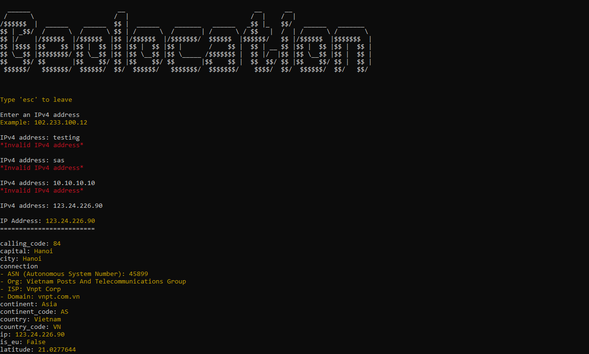
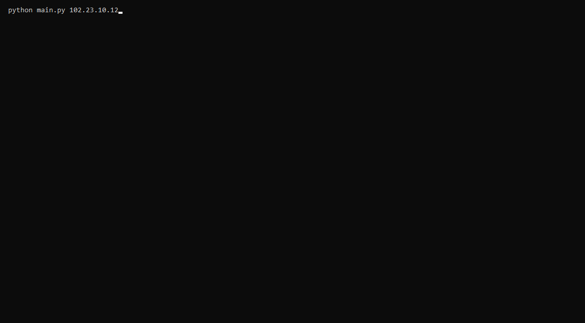

# Program:    Geo-location
_Desc:       Using an API to display data about a geographic location based on an IPv4 address_
- Started:    04.01.23
- Updated:    17.05.24
- Developer:  RFX
- Status:     **COMPLETE**
---

### Download
- Download the zipped folder, and extract OR
```
git clone https://github.com/R-F-X/Py_data.git
```

### Install required python modules
- Install Python and pip
- Run the following command in the command line to install all the required modules
```
pip install -r requirements.txt 
```

### Running the program from the command line
```
# defualt mode
python main.py

OR 

# command-line-argument mode
python main.py <IPv4 address>
```


### Sources of the APIs 
- https://ipapi.co
- https://ipwhois.io/


### Screenshots




temp...
ore test here

